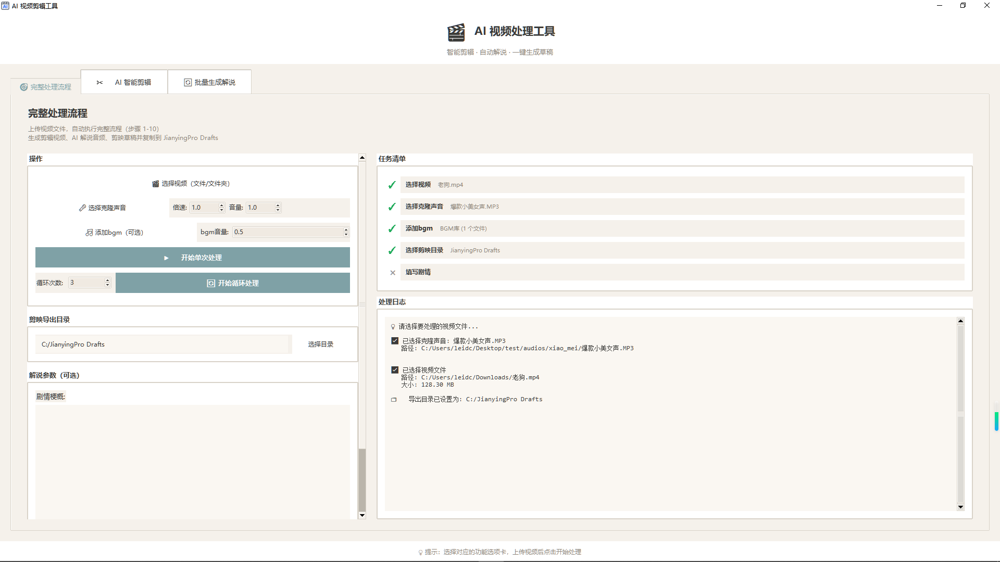
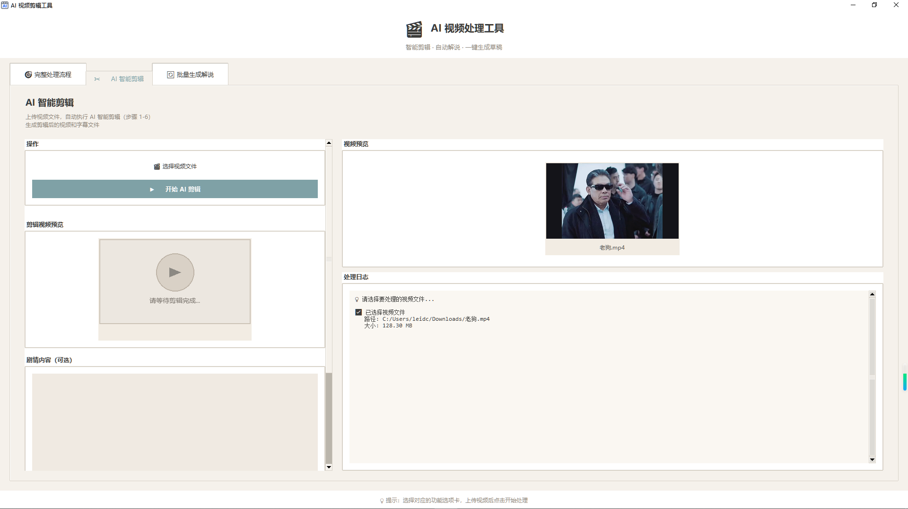
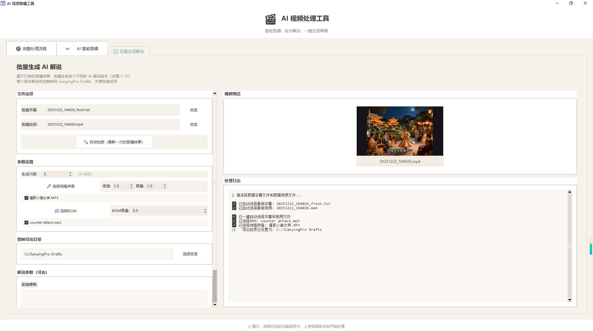

# 🎬 AI 视频处理工具

一个基于 AI 的视频剪辑和解说生成工具，能够自动识别视频内容、智能剪辑、生成 AI 解说，并一键导出为剪映（CapCut）项目。


## ✨ 主要功能

### 🎯 完整处理流程
从原始视频到剪映项目的一站式处理：
1. **视频转音频** - 提取视频音轨
2. **音频转字幕** - AI 语音识别生成字幕
3. **AI 智能剪辑** - 分析内容自动剪辑
4. **AI 解说生成** - 根据剧情生成解说文案
5. **TTS 语音合成** - 将解说文案转为语音（支持声音克隆、倍速、音量调节）
6. **BGM 背景音乐** - 支持添加背景音乐（单文件或文件夹随机选择）
7. **OCR 字幕识别** - 识别原字幕在影片中的位置并使用模糊蒙版覆盖
8. **剪映项目生成** - 自动生成可导入的项目文件（⚠️ 仅支持最高JianYing Pro 5.9及以下版本）

### ✂️ AI 智能剪辑
- 自动分析视频内容
- 基于 AI 的精彩片段提取
- 根据字幕时间戳精确剪辑

### 🔄 批量生成解说
- 支持多次生成不同风格的解说
- 批量处理多个视频片段
- 自定义解说风格和语音

### 🎵 BGM 背景音乐
- BGM库管理：所有BGM文件统一存储在 `workspace/bgm/` 目录
- 随机选择：处理视频时从BGM库中随机选择一个BGM文件
- 批量添加：支持单文件或文件夹批量添加BGM到库
- BGM音量独立调节（0.0-2.0）
- 自动适配视频长度（过长裁剪，过短循环）

## 🖼️ 界面预览

工具提供现代化的图形界面，包含三个功能面板：
- **完整处理流程** - 一键完成所有步骤
- **AI 智能剪辑** - 单独执行剪辑功能
- **批量生成解说** - 批量处理解说任务

### 完整处理流程界面



### AI 智能剪辑界面



### 批量生成解说界面



### 任务清单
界面右侧显示实时任务清单，清晰展示各项配置状态：
- ✓ 选择视频（必须）- 支持单文件或文件夹批量处理
- ✓ 选择克隆声音（必须）- TTS声音克隆参考音频
- ✓ 选择BGM（可选）- 单文件或文件夹随机模式
- ✓ 选择剪映目录（必须）- 导出目标路径
- ✓ 填写剧情（可选）- 剧情梗概辅助AI生成解说

## 📦 安装

### 环境要求
- Python 3.8+
- Windows 10/11
- FFmpeg（需要放置在 `workspace/ffmpeg/` 目录下，包含 `ffmpeg.exe`、`ffprobe.exe`、`ffplay.exe`）

### 安装依赖

```bash
pip install -r requirements.txt
```

### 依赖说明

| 依赖包 | 版本 | 说明 |
|--------|------|------|
| PyYAML | ≥6.0 | 配置文件处理 |
| requests | ≥2.28.0 | HTTP 请求 |
| opencv-python | ≥4.8.0 | 视频处理 |
| Pillow | ≥10.0.0 | 图像处理 |
| numpy | ≥1.24.0,<2.0.0 | 数值计算（注意：NumPy 2.x 与 PyInstaller 打包有兼容性问题） |
| paddleocr | ≥3.0.0 | OCR 字幕识别 |
| paddlepaddle | ≥2.5.0 | PaddlePaddle 框架（CPU版本，GPU 版本请使用 paddlepaddle-gpu） |

## 🚀 快速开始

### 1. 准备 FFmpeg

将 FFmpeg 可执行文件放置到工作空间目录：

1. 在桌面创建 `workspace` 文件夹（如果不存在）
2. 在 `workspace` 文件夹下创建 `ffmpeg` 文件夹
3. 将以下三个文件复制到 `workspace/ffmpeg/` 目录：
   - `ffmpeg.exe`
   - `ffprobe.exe`
   - `ffplay.exe`

完整路径示例：`C:\Users\你的用户名\Desktop\workspace\ffmpeg\ffmpeg.exe`

> 💡 **提示**：程序启动时会自动检查 FFmpeg 文件，如有缺失会在日志中提示。

### 2. 配置文件

项目支持两种配置方式：

#### 方式一：从 API 获取加密配置（推荐）

通过环境变量或配置文件设置 API 地址和密钥：

**环境变量方式（推荐）**：
```bash
set CONFIG_API_URL=your-api-url
set CONFIG_API_KEY=your-api-key
```

**配置文件方式**：
编辑 `configs/config.yaml` 中的 `config_source` 部分：

```yaml
config_source:
  api_url: "your-api-url"  # 例如: "http://localhost:5000/api/get"
  api_key: "your-api-key"  # 例如: "your-secret-key-here"
```

#### 方式二：本地配置文件

如果使用本地配置文件，编辑 `configs/config.yaml`：

```yaml
# TTS 配置（基础配置，实际参数从UI界面设置）
tts:
  model: "Index-TTS-2"
  api:
    base_url: "your-tts-api-base-url"
    api_key: "your-tts-api-key"
  # 以下参数在UI中设置，此处作为默认值
  # reference_audio: 从UI选择克隆声音
  # speed: 从UI设置倍速（默认1.0）
  # volume: 从UI设置音量（默认1.0）
  
# ASR 配置
audio_to_subtitles:
  api_url: "your-asr-api-url"
  api_key: "your-asr-api-key"

# Dify 工作流配置
dify:
  user: "your-user-name"
  base_url: "http://your-dify-server/v1"
  workflows:
    commentary:
      api_key: "your-commentary-api-key"
      description: "AI解说工作流"
    editing:
      api_key: "your-editing-api-key"
      description: "AI剪辑工作流"
    typo_correct:
      api_key: "your-typo-correct-api-key"
      description: "错别字修正工作流"
```

> 💡 **注意**：
> - TTS的克隆声音、倍速、音量等参数现在直接在UI界面中设置，无需修改配置文件
> - 配置文件支持从 API 获取加密配置，优先使用环境变量，其次使用配置文件中的 `config_source`

### 3. 启动应用

```bash
# 方式一：直接运行 Python
python UI/main.py

# 方式二：使用打包好的 exe (如果有)
./视频剪辑工具.exe
```


## 📁 项目结构

```
common_video/
├── configs/                # 配置文件
│   ├── config.yaml        # 主配置（包含所有配置，包括 Dify API）
│   └── get_configs.py     # 配置获取工具（支持从API获取加密配置）
├── core/                   # 核心功能
│   ├── gen_json.py        # 剪映项目生成
│   └── video_editing.py   # 视频剪辑
├── dify/                   # Dify AI 工作流
│   ├── base.py            # 基础客户端
│   └── workflows.py       # 工作流调用（commentary、editing、typo_correct）
├── services/               # 服务层
│   ├── audio_to_subtitles.py  # 音频转字幕（ASR）
│   ├── tts_client.py      # TTS 客户端（支持倍速、音量控制）
│   ├── video_to_audio.py  # 视频转音频
│   └── get_highlight.py   # 高光片段提取
├── UI/                     # 图形界面
│   ├── main.py            # 主界面入口
│   ├── components/        # UI 组件
│   │   ├── full_pipeline_panel.py  # 完整处理流程面板
│   │   ├── editing_panel.py        # AI智能剪辑面板
│   │   └── multi_commentary_panel.py # 批量生成解说面板
│   ├── services/          # UI 服务层
│   │   └── pipeline_service.py     # 流程服务
│   └── utils/             # UI 工具
│       ├── ui_helpers.py  # UI辅助函数
│       ├── video_player.py # 视频播放器
│       └── video_preview.py # 视频预览组件
├── utils/                  # 工具函数
│   ├── config_loader.py   # 配置加载器（支持API获取配置）
│   ├── loggers.py         # 日志系统
│   ├── meta_json.py       # 剪映 JSON 模板（含BGM轨道）
│   ├── jianying_drafts.py # 剪映草稿处理
│   ├── audio_handler/     # 音频处理
│   │   ├── audio_processor.py # 音频处理（BGM音量、时长调整）
│   │   └── concat_audio.py    # 音频拼接
│   ├── subtitle_detector/ # 字幕检测
│   │   ├── subtitle_detector.py # 字幕检测器
│   │   └── ocr_api_server.py    # OCR API服务
│   └── text_handler/       # 文本处理
│       ├── text_to_srt.py  # 文本转SRT
│       └── fresh_timeline.py # 时间轴刷新
├── resources/              # 资源文件
│   └── ui/
│       └── icon.png       # 应用图标
├── step.py                 # 处理步骤定义（10个步骤）
├── build_proj.py           # 项目构建脚本
├── requirements.txt        # 依赖列表
└── workspace/              # 工作空间（自动创建在桌面）
    ├── ffmpeg/            # FFmpeg 可执行文件（需手动放置）
    ├── videos/            # 视频文件
    ├── audios/            # 音频文件
    ├── srt_files/         # 字幕文件
    ├── json/              # 剪映项目JSON
    ├── bgm/               # BGM文件
    └── logs/              # 日志文件
```

## 🔧 处理流程

```
┌─────────────────────────────────────────────────────────────────────┐
│                        完整处理流程                                   │
├─────────────────────────────────────────────────────────────────────┤
│                                                                     │
│  ┌──────────┐    ┌──────────┐    ┌──────────┐    ┌──────────┐     │
│  │  原始视频  │───▶│ 提取音频  │───▶│ 语音识别  │───▶│ AI剪辑   │     │
│  └──────────┘    └──────────┘    └──────────┘    └──────────┘     │
│                                                         │          │
│                                                         ▼          │
│  ┌──────────┐    ┌──────────┐    ┌──────────┐    ┌──────────┐     │
│  │ 剪映项目  │◀───│ TTS合成   │◀───│ AI解说   │◀───│ 视频剪辑  │     │
│  └──────────┘    └──────────┘    └──────────┘    └──────────┘     │
│                                                                     │
└─────────────────────────────────────────────────────────────────────┘
```

## 🎨 特色功能

### 智能字幕检测
- 使用 PaddleOCR 自动检测视频中的字幕位置
- 自动生成字幕蒙版（模糊效果）
- 支持多种视频比例（16:9、4:3、9:16 等）

### 剪映项目生成
- 自动生成 `draft_content.json` 和 `draft_meta_info.json`
- 支持视频轨道、音频轨道、字幕轨道、BGM轨道
- 自动添加转场效果
- 可直接导入剪映专业版

### TTS 语音合成
- 支持声音克隆（从UI直接选择参考音频）
- 可调节语速（0.1-2.0倍速）
- 可调节音量（0.1-2.0）
- 批量生成音频文件

### BGM 背景音乐处理
- 使用 FFmpeg 进行音频处理
- 自动调整BGM音量
- 智能适配视频长度：
  - BGM过长：在视频结束处裁剪
  - BGM过短：自动循环播放
- 支持随机选择模式（文件夹内随机）

## 📝 使用示例

### GUI 界面使用

#### 完整处理流程面板

1. **🎬 选择视频（文件/文件夹）**
   - **单文件模式**：点击按钮后选择单个视频文件，将对该视频进行完整处理流程
   - **文件夹模式**：点击按钮后选择包含视频的文件夹，程序会自动识别文件夹内所有视频文件（支持常见格式：mp4、avi、mkv、mov、flv、wmv等），并对每个视频依次执行完整处理流程
   - 选择后，界面右侧任务清单会显示已选择的视频数量

2. **🎤 选择克隆声音**
   - 选择用于TTS语音合成的参考音频文件（必须项）
   - 该音频将作为声音克隆的参考，生成的解说语音会模仿参考音频的音色和语调
   - 建议选择清晰、无背景噪音的音频文件

3. **TTS参数设置**
   - **倍速**：调整生成语音的播放速度，范围0.5-2.0倍，默认1.0（正常速度）
     - 小于1.0：语速变慢
     - 大于1.0：语速变快
   - **音量**：调整生成语音的音量大小，范围0.1-2.0，默认1.0（正常音量）
     - 小于1.0：音量降低
     - 大于1.0：音量增大

4. **🎵 添加BGM（可选）**
   - 点击"添加bgm"按钮后可以选择BGM音频文件或包含BGM的文件夹
   - **单文件模式**：选择单个音频文件，文件会被复制到 `workspace/bgm/` 目录
   - **文件夹模式**：选择包含BGM的文件夹，程序会自动识别文件夹内所有音频文件并复制到 `workspace/bgm/` 目录
   - **BGM库管理**：所有添加的BGM文件都会存储在 `workspace/bgm/` 目录中，形成BGM库
   - **随机选择**：处理视频时，程序会从BGM库中随机选择一个BGM文件使用
   - **BGM音量**：可单独调节BGM的音量大小，范围0.0-2.0，默认0.5（建议值）
   - **自动适配**：BGM会自动适配视频长度：过长会裁剪，过短会循环播放

5. **选择剪映目录**
   - 点击"选择目录"按钮，选择剪映专业版的项目草稿目录
   - 处理完成后，生成的剪映项目文件会自动复制到该目录
   - 这是必须项，未选择无法开始处理

6. **填写剧情（可选）**
   - 在"剧情梗概"文本框中输入视频的剧情简介或背景信息
   - 这些信息会帮助AI更好地理解视频内容，生成更准确的解说文案
   - 如果不填写，AI会根据视频字幕自动分析生成解说

7. **▶️ 开始单次处理**
   - 点击后开始执行一次完整的处理流程
   - 如果选择的是文件夹，会依次处理文件夹内的所有视频
   - 处理过程中按钮会禁用，完成后自动恢复

8. **🔄 开始循环处理**
   - 在"循环次数"输入框中设置循环次数（2-10次）
   - 点击后会对选择的视频执行多次完整处理流程
   - 每次循环都会重新生成AI剪辑和AI解说，适合需要生成多个不同版本解说的场景
   - 例如：设置循环3次，选择1个视频，会生成3个不同版本的剪辑和解说

#### 任务清单

界面右侧显示实时任务清单，清晰展示各项配置状态：
- ✓ **选择视频**（必须）- 显示已选择的视频文件数量
- ✓ **选择克隆声音**（必须）- 显示是否已选择参考音频
- ✓ **添加bgm**（可选）- 显示是否已选择BGM
- ✓ **选择剪映目录**（必须）- 显示是否已选择导出路径
- ✓ **填写剧情**（可选）- 显示是否已填写剧情梗概

所有必须项完成后，"开始单次处理"和"开始循环处理"按钮才会启用。

#### AI 智能剪辑面板

该面板用于单独执行视频剪辑功能，不包含AI解说生成。

1. **🎬 选择视频文件**
   - 选择单个视频文件进行剪辑处理
   - 注意：此面板仅支持单文件模式，不支持文件夹批量处理

2. **填写剧情内容（可选）**
   - 在文本框中输入视频的剧情简介
   - 帮助AI更好地理解视频内容，生成更精准的剪辑方案
   - 不填写时，AI会根据视频字幕自动分析

3. **▶️ 开始 AI 剪辑**
   - 点击后开始执行AI智能剪辑流程
   - 处理完成后，可以在"剪辑视频预览"区域查看剪辑结果
   - 剪辑后的视频会保存到指定位置

#### 批量生成解说面板

该面板用于批量生成多个视频的AI解说，不包含视频剪辑功能。

1. **选择视频文件**
   - 选择单个视频文件
   - 该面板专注于解说生成，一次处理一个视频

2. **🎤 选择克隆声音**
   - 选择TTS语音合成的参考音频文件（必须项）
   - 生成的解说语音会模仿参考音频的音色

3. **TTS参数设置**
   - **倍速**：调整语音播放速度（0.5-2.0倍，默认1.0）
   - **音量**：调整语音音量大小（0.1-2.0，默认1.0）

4. **🎵 选择BGM（可选）**
   - 选择背景音乐文件
   - **BGM音量**：可单独调节BGM音量（0.0-2.0，默认0.5）

5. **选择剪映目录**
   - 选择剪映专业版的项目草稿目录
   - 生成的剪映项目文件会复制到该目录

6. **▶️ 开始生成解说**
   - 点击后开始生成AI解说
   - 处理完成后会生成包含解说的剪映项目文件

### 代码调用

```python
from step import (
    step1_video_to_audio,
    step2_audio_to_subtitles,
    step3_ai_editing_workflow,
    step4_editing_text_to_srt,
    step5_edit_video,
    step6_refresh_timeline,
    step7_ai_commentary_workflow,
    step8_commentary_text_to_srt,
    step9_generate_capcut_project,
    step10_copy_project_to_destination
)

# 步骤 1：视频转音频
result1 = step1_video_to_audio()

# 步骤 2：音频转字幕
result2 = step2_audio_to_subtitles(
    result1["audio_output_path"],
    result1["video_src_path"]
)

# 步骤 3：AI 智能剪辑
result3 = step3_ai_editing_workflow(result2["original_text"])

# 步骤 9：生成剪映项目（支持BGM）
result9 = step9_generate_capcut_project(
    edited_video="path/to/video.mp4",
    commentary_srt_file="path/to/commentary.srt",
    reference_audio="path/to/voice.mp3",  # 克隆声音
    tts_speed=1.0,                         # TTS倍速
    tts_volume=1.0,                        # TTS音量
    bgm_path="path/to/bgm.mp3",           # BGM文件（可选）
    bgm_volume=0.5                         # BGM音量（可选）
)

# ... 后续步骤
```

### 处理流程详解

完整处理流程包含 10 个步骤：

1. **步骤 1：视频转音频** - 使用 FFmpeg 提取视频音轨
2. **步骤 2：音频转字幕** - 调用 ASR API 进行语音识别，生成 SRT 字幕文件
3. **步骤 3：AI 智能剪辑** - 调用 Dify 剪辑工作流，分析内容并生成剪辑方案
4. **步骤 4：剪辑文本转 SRT** - 将 AI 生成的剪辑文本转换为带时间戳的 SRT 文件
5. **步骤 5：根据 SRT 剪辑视频** - 根据 SRT 时间戳精确剪辑视频片段
6. **步骤 6：刷新时间戳** - 将剪辑后的 SRT 时间戳从 00:00:00 开始重新计算
7. **步骤 7：AI 解说工作流** - 调用 Dify 解说工作流，根据剪辑内容生成解说文案
8. **步骤 8：解说文本转 SRT** - 将解说文本转换为带时间戳的 SRT 文件
9. **步骤 9：生成剪映项目** - 生成 TTS 音频、处理 BGM、OCR 字幕检测、生成剪映项目 JSON
10. **步骤 10：复制项目到目标目录** - 将生成的剪映项目复制到指定导出目录

### 错别字修正功能

项目支持通过 Dify 工作流进行错别字修正，在步骤 7 和步骤 8 之间自动调用（如果配置了 `typo_correct` 工作流）。

## ⚠️ 注意事项

1. **API 配置**：使用前请确保已正确配置以下 API：
   - Dify API（AI 剪辑、AI 解说、错别字修正工作流）
   - TTS API（语音合成）
   - ASR API（音频转字幕）
   - 配置 API（可选，用于获取加密配置文件）

2. **FFmpeg**：需要手动将 FFmpeg 文件放置到 `workspace/ffmpeg/` 目录，程序启动时会自动检查

3. **工作空间**：程序会在桌面自动创建 `workspace` 文件夹，用于存储所有工作文件（视频、音频、字幕、日志等）

4. **GPU 加速**：PaddleOCR 支持 GPU 加速，可安装 `paddlepaddle-gpu` 提升性能

5. **视频格式**：支持常见视频格式（mp4、avi、mkv、mov、flv、wmv 等）

6. **音频格式**：BGM支持常见音频格式（mp3、wav、m4a、flac、aac 等）

7. **剪映版本**：生成的项目仅支持 JianYing Pro 5.9 及以下版本

8. **TTS参数**：克隆声音、倍速、音量等参数在UI界面中设置，无需修改配置文件

9. **配置文件**：支持从 API 获取加密配置，优先使用环境变量 `CONFIG_API_URL` 和 `CONFIG_API_KEY`

10. **打包支持**：项目支持 PyInstaller 和 Nuitka 打包，已内置打包环境适配代码

## 🔨 打包

项目支持使用 PyInstaller 或 Nuitka 打包为可执行文件。

### 使用 PyInstaller

```bash
pyinstaller --onefile --windowed --icon=resources/ui/icon.png --name=AI剪辑工具 UI/main.py
```

### 使用 Nuitka

```bash
python -m nuitka --onefile --windows-icon-from-ico=resources/ui/icon.png --output-dir=dist UI/main.py
```

### 打包注意事项

1. **资源文件**：确保 `resources/` 目录下的文件被正确打包
2. **配置文件**：打包后的程序仍需要配置文件，建议将 `configs/` 目录与 exe 放在同一目录
3. **工作空间**：打包后的程序会在桌面创建 `workspace` 目录，用户需要手动放置 FFmpeg 文件
4. **依赖检查**：打包前确保所有依赖已正确安装

## 🤝 贡献

欢迎提交 Issue 和 Pull Request！

